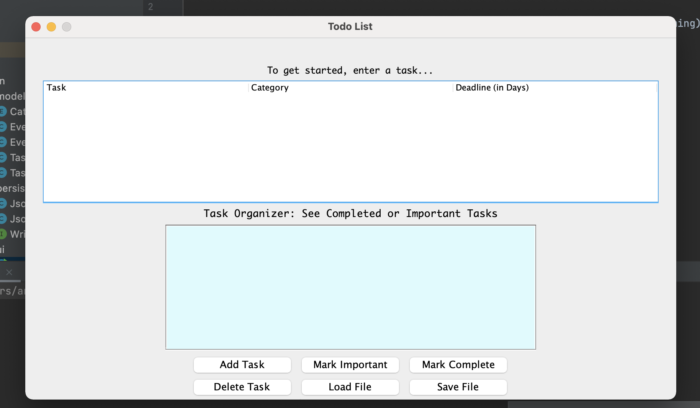
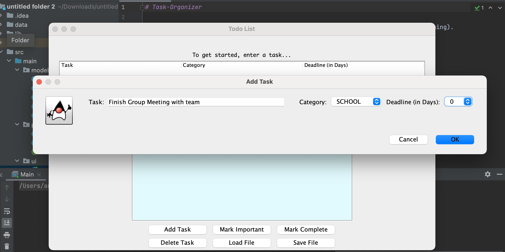

# Task-Organizer

Task Orgainzer was made as a term project for UBC CPSC 210 (Object-Oriented Programming). As an avid user of to-do lists, I was interested in making my own implementation to manage my day-to-day tasks. To learn about OOP and program structures, I wanted to make an application that users can use to organize and schedule their tasks using an easy-to-use and simple graphical interface. The program supports the viewing, adding, and removing of a task, as well as the ability to mark a task as <b> important </b> or <b> complete. </b> Each Task requires the user to input the name of the task, the category, and the deadline till how many days it's due. In addition, the application can read and update a local file that contains the stored data.

To view the application, simply right click on the 'main' class to run the file.

### Functionality:

- Addition, removal and viewing of a task.
- Marking a task as complete or important, seperating it from other normal tasks
- Saving and loading local file with data
- Printing the date and time into the console when a task is added or removed

### Programming Practices:

As a school project, this application has a focus in fundamental practices and structures such as black-box testing with JUnit, and design patterns like Java's Iterator pattern for the EventLog.

Task-Organizer was primarily a learning experience and my first attempt at making a complete application. This project taught me a lot about the language of Java and the process behind making a well-written program.
